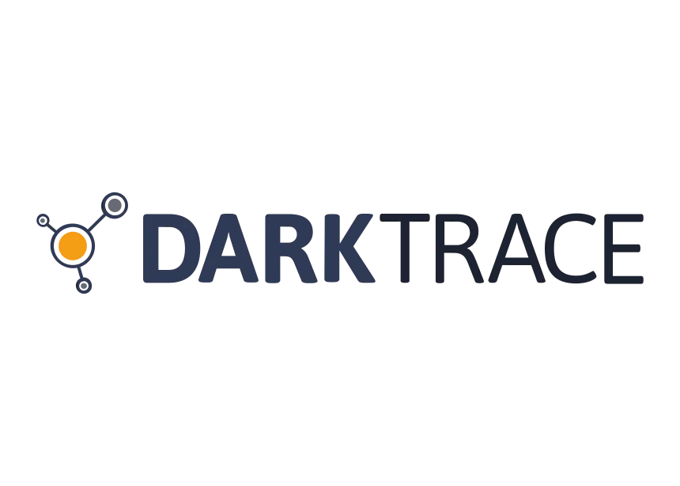
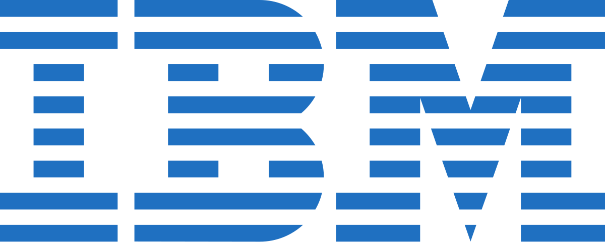

# **Gestió de la Seguretat amb Intel·ligència Artificial**

---

## **Índex**
1. [Introducció](#introducció)
2. [Darktrace](#darktrace)
   - [Les aplicacions de la IA](#les-aplicacions-de-la-ia-darktrace)
   - [Impacte al sector](#impacte-al-sector-darktrace)
   - [Impacte ambiental](#impacte-ambiental-darktrace)
   - [Propostes per minimitzar els impactes ambientals](#propostes-per-minimitzar-els-impactes-ambientals-darktrace)
3. [IBM Watson for Cybersecurity](#ibm-watson-for-cybersecurity)
   - [Les aplicacions de la IA](#les-aplicacions-de-la-ia-ibm)
   - [Impacte al sector](#impacte-al-sector-ibm)
   - [Impacte ambiental](#impacte-ambiental-ibm)
   - [Propostes per minimitzar els impactes ambientals](#propostes-per-minimitzar-els-impactes-ambientals-ibm)
4. [Conclusions](#conclusions)
5. [Referències](#referències)

---

## **Introducció**
La **seguretat informàtica** és un dels reptes més rellevants del món digital actual. Amb l'augment constant de les **amenaces cibernètiques**, com els atacs de ransomware i les filtracions de dades, les empreses han de cercar **noves maneres** d'assegurar els seus sistemes i dades. Les tècniques tradicionals de seguretat ja **no són suficients** per afrontar les amenaces cada vegada més complexes.

La **intel·ligència artificial (IA)** ha emergit com una solució potent per millorar la seguretat informàtica. Mitjançant **algorismes** d’aprenentatge automàtic, els sistemes basats en IA poden **identificar patrons** de comportament anòmals i **preveure possibles** atacs abans que es produeixin. A més, la IA permet **automatitzar tasques de seguretat**, reduint el **temps** de resposta davant incidents i augmentant l'eficiència dels analistes de seguretat.

---

# [**Darktrace**](https://www.darktrace.com)





### **Les aplicacions de la IA**  
**Darktrace** és una solució de seguretat basada en **intel·ligència artificial** utilitza **algorismes d’aprenentatge automàtic** per detectar comportaments anòmals dins de les xarxes. Respon automàticament davant d'amenaces com el **ransomware** o els **atacs zero-day**.

Es caracteritza per **intentar imitar el sistema immunològic humà**. El que ho ha aportat com una de les maneres més **innovadores** i **referencials** dins del sector.
 
- Detectar comportaments sospitosos dins de xarxes corporatives.  
- Monitoritzar en temps real el trànsit de xarxes internes.  
- Automatitzar respostes davant **ciberatacs**.  
- Identificar atacs de tipus **ransomware** i **phishing** abans que es propaguin.

> "Recent advancements in generative AI and LLMs are an important addition to the growing arsenal of AI techniques that will transform cybersecurity."
-Jack Stockdale, DarkTrace Tecnology Director.

### **Impacte al sector**  
**Darktrace** ha tingut un impacte significatiu en la ciberseguretat, **revolucionant la protecció de les xarxes i sistemes empresarials** contra les amenaces cibernètiques. Ha **establert nous estàndards** en la detecció i resposta a amenaces, utilitzant la intel·ligència artificial i **l'aprenentatge automàtic per identificar i neutralitzar riscos** en temps real.

 Ha demostrat ser eficaç en la **protecció d'infraestructures crítiques** com els sistemes de trànsit aeri, energia i subministrament d'aigua. La seva tecnologia ha **reduït el risc d'atacs cibernètics**, permetent a les empreses reduir costos de seguretat i augmentar la confiança en la protecció dels seus actius.
 
  Darktrace també ha millorat la **col·laboració entre els equips de seguretat** i TI, promovent una resposta més ràpida a les amenaces. Finalment, ha **impulsat la innovació en la ciberseguretat**, desenvolupant noves tecnologies per afrontar amenaces emergents.

  #### Impacte en els sectors específics

- **Sector financer**: Darktrace ha estat adoptada per nombrosos bancs i institucions financeres per protegir els seus sistemes i xarxes contra les amenaces cibernètiques.
  
- **Sector de la salut**: Darktrace ha estat utilitzada per hospitals i proveïdors de serveis de salut per protegir la informació dels pacients i prevenir els atacs cibernètics.

- **Sector de l'energia**: Darktrace ha estat adoptada per empreses d'energia per protegir els seus sistemes de control i xarxes contra les amenaces cibernètiques.

- **Sector del govern**: Darktrace ha estat utilitzada per agències governamentals per protegir els seus sistemes i xarxes contra les amenaces cibernètiques.


### **Impacte ambiental**  
Tot i que no hi ha informació directa sobre l'impacte mediambiental de Darktrace, es pot inferir que l'empresa pot tenir un **impacte indirecte** en el medi ambient a través de l'ús de la tecnologia i les seves operacions. Per exemple, l'empresa pot generar residus electrònics a través de la producció i l'ús dels seus productes i serveis. A més, es pot observar un elevat **consum energètic** pels centres de dades on s'analitzen els patrons, així com una dependència de servidors per a la monitorització constant. Això comporta també una generació de **residus electrònics** per mantenir la infraestructura actualitzada.


### **Propostes per minimitzar els impactes ambientals**  
1. **Centres de dades verds**: Utilitzar energia renovable per reduir les emissions.  
2. **Optimització d'algoritmes**: Reduir el consum de recursos mantenint la mateixa eficàcia.  
3. **Refrigeració eficient**: Implementar sistemes avançats per disminuir el consum energètic.  

---

# [**IBM Watson**](https://www.ibm.com/watson)




### **Les aplicacions de la IA**  


IBM Watson és una solució d'intel·ligència artificial desenvolupada per IBM que es basa en **l'aprenentatge automàtic i el processament del llenguatge natural per analitzar grans volums de dades**. Proporciona suport en la presa de decisions i ajuda a millorar l'eficiència en diferents sectors.

Es caracteritza per les seves capacitats **d'anàlisi avançada** i **l'automatització de processos**, oferint solucions innovadores en la seguretat informàtica i altres àmbits crítics.

- **Anàlisi de dades massives** per detectar patrons sospitosos i predir riscos.
- **Millora de la presa de decisions** mitjançant la interpretació intel·ligent de la informació.
- **Identificació proactiva d'amenaces** abans que es converteixin en incidents greus.
- **Monitorització en temps real** de xarxes i sistemes per prevenir atacs.
- **Suport en sectors crítics** com finances, salut i govern, protegint informació sensible.

> "The combination of machine learning and AI enables organizations to uncover hidden threats and gain new insights into their security landscape."  
> — **Rob Thomas**, Senior Vice President, IBM


```bash
# Exemple d’ús de Watson en línia de comandes per identificar amenaces
curl -X POST "https://api.ibm.com/security/analyze" \
  -H "Authorization: Bearer <TOKEN>" \
  -d '{"data": "logs"}'
```

### **Impacte en el sector**

IBM Watson ha tingut un impacte significatiu en el sector de la ciberseguretat, proporcionant solucions innovadores per abordar els reptes de la seguretat en l'era digital. Les seves aplicacions han revolucionat la manera en què les organitzacions detecten, responen i gestionen les amenaces cibernètiques.

Es caracteritza per l’automatització de processos i l’anàlisi predictiva, permetent una resposta proactiva i efectiva a atacs avançats.

- **Millora de la detecció de ciberamenaces**: Watson pot identificar atacs avançats i desconeguts mitjançant l’anàlisi de grans volums de dades, detectant patrons sospitosos abans que les amenaces es materialitzin.  
- **Reducció del temps de resposta**: Automatitza l’anàlisi i redueix el temps de reacció davant d'incidents, minimitzant l'impacte dels atacs.  
- **Suport als sectors crítics**: És especialment eficaç en sectors com **finances**, **salut** i **administració pública**, protegint dades sensibles i reduint riscos de frau econòmic.  
- **Augment de l'eficiència**: Automatitza tasques rutinàries dels analistes humans, permetent focalitzar recursos en accions estratègiques de seguretat.  
- **Millora de la presa de decisions**: Proporciona anàlisi i informació precisa per facilitar decisions informades en matèria de seguretat.  
- **Facilitació de la col·laboració**: Fomenta una millor coordinació entre els equips de seguretat i altres departaments, millorant la resposta global als incidents.  

En resum, IBM Watson ha establert un nou estàndard en la **gestió proactiva de ciberamenaces**, oferint una solució eficient i eficaç per a la detecció i resposta davant d’amenaces complexes.


### **Sectors específics on treballa IBM Watson**

IBM Watson ha estat adoptat en una àmplia varietat de sectors crítics gràcies a les seves capacitats avançades d’intel·ligència artificial i anàlisi de dades:

- **Sector financer**:  
  Protegeix bancs i institucions financeres mitjançant l'anàlisi de transaccions per detectar **fraus** i **comportaments anòmals**. Ajuda a garantir la seguretat de dades sensibles i a prevenir pèrdues econòmiques.

- **Sector de la salut**:  
  Ajuda hospitals i proveïdors de serveis sanitaris a protegir la **informació confidencial dels pacients** i a detectar atacs en temps real que podrien afectar els sistemes mèdics.

- **Sector de l’energia**:  
  Proporciona seguretat als sistemes de control i xarxes de distribució energètica, prevenint atacs que podrien afectar infraestructures crítiques com xarxes elèctriques.

- **Sector governamental**:  
  Ajuda a les **agències governamentals** a protegir les seves xarxes i dades contra atacs cibernètics dirigits, assegurant la seguretat de la informació estatal.

- **Sector empresarial**:  
  Millora la seguretat en corporacions multinacionals mitjançant la **monitorització en temps real** de les xarxes internes, protegint actius i dades corporatives.

IBM Watson s’ha consolidat com una eina essencial en aquests sectors, ajudant a prevenir atacs, protegir dades crítiques i garantir la continuïtat de les operacions en un entorn digital cada vegada més complex.


---

### **Impacte ambiental**  

Tot i que no existeixen dades específiques sobre l’**impacte mediambiental** directe d’**IBM Watson**, es pot inferir que la seva activitat té un impacte **indirecte** degut a l’ús intensiu de **tecnologia** i **recursos**. L’entrenament i l’execució dels models d’**intel·ligència artificial** requereixen un **consum energètic elevat** a causa de l’ús constant de **centres de dades**, que consumeixen grans quantitats d’**energia** i contribueixen a les **emissions de carboni**. A més, la **dependència** d’aquests centres per a l’**anàlisi** i **monitorització** de dades en temps real incrementa la **petjada mediambiental**. Al mateix temps, la necessitat de mantenir i actualitzar la **infraestructura tecnològica** genera **residus electrònics**, com ara equips obsolets i components de maquinari que poden tenir un impacte negatiu si no són gestionats correctament.

---

### **Propostes per minimitzar els impactes ambientals**

**IBM i la sostenibilitat**: IBM té plans ambiciosos per contribuir a la sostenibilitat del medi ambient amb una visió clara per a l’any **2030**. Aquests plans inclouen objectius específics per reduir l’impacte ambiental de les seves operacions i promoure pràctiques sostenibles. A continuació, es detallen alguns dels seus compromisos més destacats:

- **Neutralitat de carboni**: IBM es compromet a assolir la **neutralitat de carboni** per al **2030**, garantint que no emetrà més gasos d’efecte hivernacle dels que pot absorbir o compensar.  
- **Reducció del consum d’energia**: L’empresa té com a objectiu disminuir el seu **consum energètic** en un **35%** per al **2025**, en comparació amb els nivells del **2015**.  
- **Ús d’energies renovables**: IBM es compromet a utilitzar **energies renovables** per cobrir almenys el **55%** del seu consum energètic per al **2025**.  
- **Reducció de residus**: Té com a meta reduir la quantitat de **residus** generats en un **50%** per al **2025**, respecte als nivells del **2015**.  
- **Reciclatge i reutilització**: IBM es compromet a **reciclar o reutilitzar** almenys el **75%** dels materials que utilitza en els seus productes i serveis.  
- **Gestió de la cadena de subministrament**: Col·laborarà amb els seus **proveïdors** per reduir l’impacte ambiental de la **cadena de subministrament** i promoure pràctiques **sostenibles**.  
- **Investigació i desenvolupament**: Continuarà invertint en **R+D** per crear **tecnologies** i **solucions** més sostenibles i eficients.  
- **Educació i conscienciació**: IBM educarà i sensibilitzarà els seus **empleats**, **clients** i **comunitats** sobre la importància de la sostenibilitat i la protecció del **medi ambient**.

Aquestes accions reflecteixen el compromís d’IBM per liderar amb exemple i avançar cap a un futur més **sostenible**.
